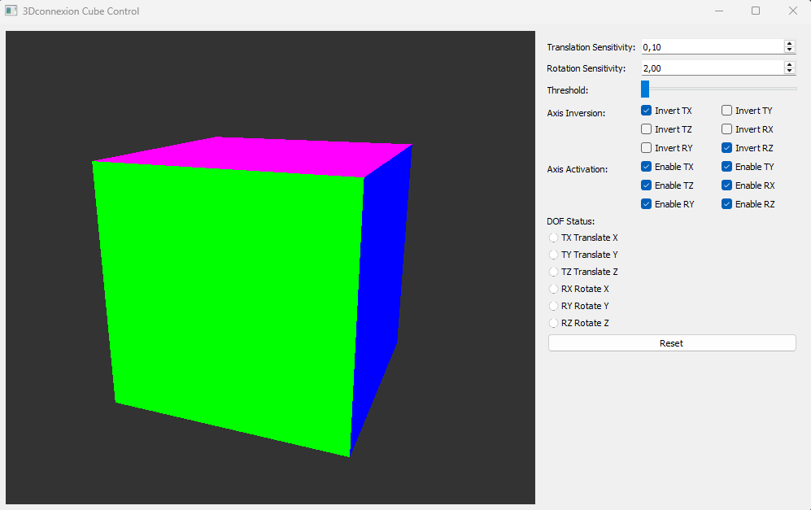

# SpaceMouse 3D Cube Controller

## Overview

This project is a 3D cube controller that allows users to manipulate a cube using a **3Dconnexion SpaceMouse**, a keyboard, or a regular mouse. The application is built using **PyQt5** for the GUI and **OpenGL** for rendering and the **PySpaceMouse** python library.



The project is modular, separating concerns into different files:

- `main.py`: Entry point of the application.
- `control_panel.py`: Handles the user interface for controlling the cube.
- `cube_widget.py`: Manages OpenGL rendering and cube transformations.
- `keyboard_mouse_input.py`: Handles keyboard and mouse input.
- `spacemouse_input.py`: Manages input from the SpaceMouse device.
- `config.py`: Stores configuration settings such as keyboard layout.
- `requirements.txt`: Lists required dependencies.


---

## Features

✅ **3Dconnexion SpaceMouse Support** – Move and rotate the cube in 3D space.\
✅ **Keyboard and Mouse Fallback** – If no SpaceMouse is connected, use the keyboard and mouse to control the cube.\
✅ **Configurable Sensitivity** – Adjust translation and rotation speeds via UI.\
✅ **Supports AZERTY & QWERTY Layouts** – Users can choose their preferred keyboard layout.\
✅ **Modular Design** – Clean separation of rendering, input handling, and UI logic.

---

## Installation & Setup

### 1️⃣ **Clone the Repository**

```sh
 git clone https://github.com/mmi-coding/SpaceMouse-3D-Cube-Python-Controller.git
 cd SpaceMouse-3D-Cube
```

### 2️⃣ **Set Up a Virtual Environment** (Recommended)

```sh
python -m venv .venv  # Create a virtual environment
source .venv/bin/activate  # On macOS/Linux
# OR
.venv\Scripts\activate  # On Windows
```

### 3️⃣ **Install Dependencies**

```sh
pip install -r requirements.txt
```

### 4️⃣ **Run the Application**

```sh
python main.py
```

---

## Controls

### **Using a SpaceMouse**

- Move the SpaceMouse to **translate** the cube.
- Rotate the SpaceMouse to **rotate** the cube.
- Press the **first button** on the SpaceMouse to **reset** the cube.

### **Using a Keyboard & Mouse** *(Fallback Mode)*

#### **Keyboard Controls**

| Action        | AZERTY | QWERTY |
| ------------- | ------ | ------ |
| Move Forward  | Z      | W      |
| Move Backward | S      | S      |
| Move Left     | Q      | A      |
| Move Right    | D      | D      |
| Move Up       | A      | Q      |
| Move Down     | E      | E      |
| Rotate Left   | ←      | ←      |
| Rotate Right  | →      | →      |
| Rotate Up     | ↑      | ↑      |
| Rotate Down   | ↓      | ↓      |
| Reset Cube    | R      | R      |

#### **Mouse Controls**

- **Left-click + Drag** – Rotate the cube.
- **Mouse Wheel** – Zoom in/out.

---

## Project Structure

```
.
├── config.py               # Configuration file (keyboard layout, sensitivity)
├── control_panel.py        # UI controls and layout
├── cube_widget.py          # OpenGL rendering and cube transformations
├── keyboard_mouse_input.py # Keyboard & mouse input handling
├── main.py                 # Application entry point
├── requirements.txt        # Python dependencies
├── spacemouse_input.py     # SpaceMouse input handling
```

---

## Troubleshooting

### **Error: No SpaceMouse Found**

If you see:

```sh
⚠ Warning: No found any connected or supported devices.
🔄 Running in fallback mode (keyboard/mouse input).
```

Your SpaceMouse is not detected. Ensure:

- The device is connected properly.
- Drivers are installed.
- Try restarting the application.

### **Keyboard/Mouse Not Responding?**

- Ensure the application window has focus.
- Check your keyboard layout in `config.py`.

---


## License

MIT License © 2025 [mmi-coding](https://github.com/mmi-coding)

